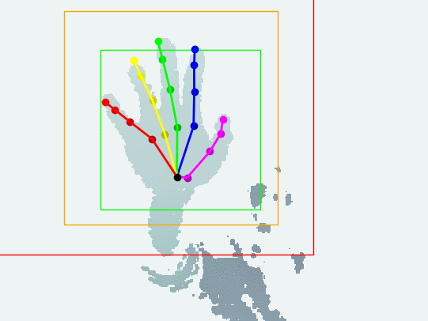

# Hand detection and tracking

> Experimental hand detection and tracking from single depth camera.

Please check the \[[Code](https://github.com/xkunwu/depth-hand/blob/master/code/camera/README.md)\] for user manual.

Note: this is a two-week quick patch following the [hand pose estimation project](https://xkunwu.github.io/research/18HandPose/18HandPose).
The purpose is to make live capture and hand tracking _possible_, but currently no plan to make the code _waterproof_ (might be a future research project).
{: .notice--info}

## Assumptions

- Single hand
- The hand is the closest to the camera
- No other objects within 'crop_range', default: 100mm-480mm
- The pre-trained model was targeted at the left hand

### Design flavors

Here 'detection' means finding the axis-aligned bounding cube (AABC) that can crop the part of hand data out.
The algorithm uses the same fixed side length as training part (default: 240mm, so sorry for testers with a huge hand :pensive:).
So the problem is reduced to find the center of that detection AABC.

The difficulties come from the noise and outlier issue inherent to the depth camera - it's very often to see a sudden jump between streaming frames, which leads to false detection.
That's why I have provided a [long list of assumptions in the previous section](#Assumptions), which can make life much easier.

#### Data denoise

This is for making hand detection more stable. Currently, I am using [Bilateral filtering](http://homepages.inf.ed.ac.uk/rbf/CVonline/LOCAL_COPIES/MANDUCHI1/Bilateral_Filtering.html).
BTW, outlier remover seems not very necessary, at least my SR300 works fine (nice job Intel).

#### Momentum stabilizer

Note: the name of this idea popped into my head randomly - not referring to any specific terminology here.

If the distance $d_{01}$ between current detection $c_1$ and previous detection $c_0$ is larger than default threshold $\lambda = 120mm$, then the algorithm will just drop current detection.
Otherwise, linear interpolation $c_0 * (1 - p) + c_1 * p$ is calculated as the detection for current frame.
Here $p$ represents the confidence of current detection, which is inverse proportional to the distance $d_{01}$: $p = exp(- \alpha * d_{01}^2)$, where $\alpha$ is calculated such that $p = 0.01$ when $d_{01} = \lambda$.

#### Exploit hand shape assumption

The shape of ordinary people's forearm and hand looks like this: the diameter of the forearm is shrinking from around the elbow to the wrist, then expand again at the palm.
So I just made the assumption that the narrowest part is located at the wrist, which is located out and set the far end of the region of interest.
To do that, I segmented the data into short sections according to the depth value, then use PCA to find the extent of each section.
Proper ordering is necessary for reducing the number of applying PCA (speed issue for real-time application).
Details could be found in the code.

#### Train a hand detector

I wrote two (2D/3D) [attention model](https://arxiv.org/abs/1506.01497) like prototype hand detector one year ago (October 2017, even before the pose estimation work started), but the real-time test was not very stable at that time.
Now I know much better about the technical issues, but the heuristic detector works just fine already.
As I have much higher priority project right now, I would like to leave it as a future work.

## FAQ

##### Q: Detection looks very inaccurate?

A: Please take a look at the [Assumptions](#Assumptions). Especially: make clear of the 100mm-480mm operating range in front of the camera, and the hand should be the closest to the camera.

##### Q: Why the detection looks flipped?

A: If the detection looks flipped, then use the left hand. This is due to the data bias in the pre-trained model. Adding code to differentiate left/right will make the algorithm somewhat messy.

##### Q: The detection looks slower than hand/finger movements?

A: This is by design due to the [Momentum stabilizer](#Momentum-stabilizer): if the motion is mildly fast, the algorithm will gradually converge to the target location.
For example, in the test sequence on the top, it's very evident to see that effect near the end of the sequence, when I was moving my hand quickly from top-right to bottom-left.
It helps for most of the cases and makes the algorithm more robust to outliers and noise.

##### Q: I observed flickering detection?

A: This is also due to the Momentum stabilizer: if the motion is faster than the stabilizer can handle, there is a gap between the data and presumed center, i.e. cropped region is misaligned to the real data, so the algorithm can produce wrong detection results.

##### Q: The detection suddenly lost?

A: If the hand jumps faster than capturing speed (larger than 120mm between frames), the algorithm will think tracking is lost and restart.

##### Note: other FAQ related to technical issues may be found at the [code README](https://github.com/xkunwu/depth-hand/blob/master/code/camera/README.md).
