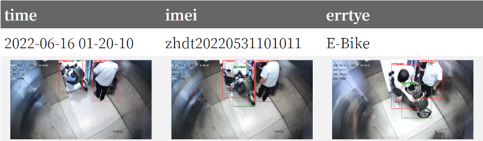

Progress: writing ...
{: .notice--danger}
<!-- Progress: proofreading ...
{: .notice--warning} -->

# Abnormal detection

## Environment

This project focus on monitoring video cameras within the *lift*.

### What counts for “abnormal”?

There are several cases that counted as *potential hazard* or against general regulations:

- E-Bike: may cause hazard situations either within the lift of the building, especially fire.
- Animal: e.g., dogs without leash.

There are also cases that may imply *accidents or emergencies*:

- Fall down: especially elder people.

## Solutions

### Hardware configuration

We have one *HKVision camera* installed on each lift.

- Data stream: *RTSP protocol*.
- Transport: UDP connection.
- Multi-threading: #camera (one thread for a single camera) plus 1 (detection logics)

### Computation on Server

Tested on an 8-core *headless 2U server* (Dell PowerEdge R540) with CentOS 7.

### Computation on Edge

Tested on *Raspberry Pi 4 Model B* (8G) with 64-bit OS.

## Visualization

Abnormal situations are sent to the server through *HTTP POST* with the following data specification:

- imei (str): unique serial number of the lift.
- errtye (int): error type.
- time (str): accurate to seconds.
- imgs (array): `base64` encoded image list.

We also provide [*front end (web UI)*](media/view_yaml.html) for data visualization.

<figure>
    
    <figcaption>Show HTTP POST Demo.</figcaption>
</figure>

## Deployment

We provide a fully configured *Docker image* containing all prerequisites and the software.
