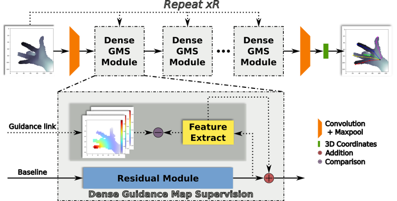

---
---

Warning: in progress.

# HandMap: Robust hand pose estimation via intermediate dense guidance map supervision

> In ECCV 2018

<links>
  [<a href="https://github.com/xkunwu/depth-hand">Code</a>]
  [<a href="http://openaccess.thecvf.com/content_ECCV_2018/papers/Xiaokun_Wu_HandMap_Robust_Hand_ECCV_2018_paper.pdf">Paper</a>]
  [<a href="/research/18HandPose/eccv2018poster1813.pdf">Poster</a>]
  [<a href="/research/18HandPose/Wu18HandPose.txt">BibTex</a>]
</links>

## Abstrct
This work presents a novel hand pose estimation framework via intermediate dense guidance map supervision. By leveraging the advantage of predicting heat maps of hand joints in detection-based methods, we propose to use dense feature maps through intermediate supervision in a regression-based framework that is not limited to the resolution of the heat map. Our dense feature maps are delicately designed to encode the hand geometry and the spatial relation between local joint and global hand. The proposed framework significantly improves the state-of-the-art in both 2D and 3D on the recent benchmark datasets.

## Problem statement and motivation
The goal is to accurately estimate hand pose, i.e. 3D location for each joint, given single depth image.

### Why is the topic important?
Human-Computer Interactions.
behavior recognition

### Why is the problem difficult?
weak description of features
strong ambiguity due to self-similarity
low signal-noise ratio
severe occlusion

## Robustness
sparse vs dense intermediate supervision
### The failure of discriminative approach
confidence score and support of heatmaps
ambiguity, false positives

### Euclidean distance function

### Geodesics

### Approximation

## Framework
Combine detection and regression

## Stand on the shoulder of giants
Our algorithm alone might not fully convince you.
But please note that the core Dense GMS Module in our algorithm is "hot-pluggable": we can easily plug it into other state-of-the-art (SOTA) methods, and achieve better performance due to added robustness.
Please check the paper for details about performance enhancements.

In short: the best of our standalone algorithms is roughly comparable to the SOTA, but we achieved much better performance after combined our algorithms with the SOTA.

## "Forthcoming Research" already came
In the poster that I prepared for the ECCV2018 conference, you can see that:
> Future work will explore temporal hand tracking using our framework ...

Well, actually this has already been realized.
Please visit the [hand tracking project](https://xkunwu.github.io/projects/depth-hand/depth-hand/) if you are interested.
