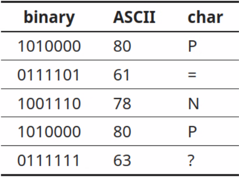
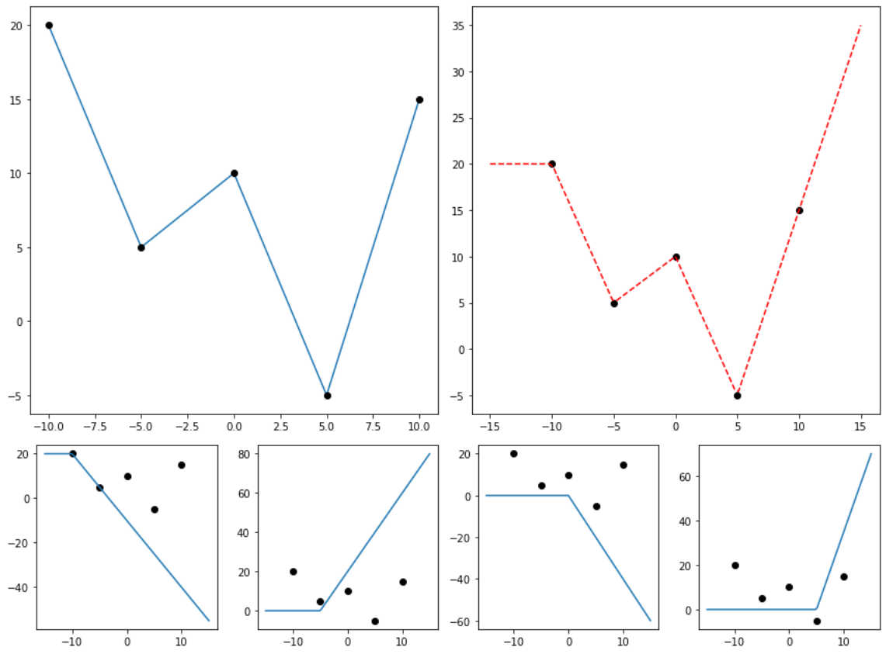

**Naming Convention**: {[Edition]} {Title} {Level} {- Sub-level/topic}

- Level I: for undergraduates.
- Level II: for graduates, may branch into specific topics.

 

  

    
  

  

    <title>[2022] Deep Learning I</title>
    <links>
      [<a href="DeepLearning2022F/2022F.html">2022F</a>]
    </links>
  

  

    
  

  

    <title>[2022] Natural Language Processing I</title>
    <links>
      [<a href="LanguageProcessing2022F/2022F.html">2022F</a>]
    </links>
  

  

    
  

  

    <title>[2021] Algorithm II</title>
    <links>
      [<a href="Algorithm/2021H.html">2021H</a>]
    </links>
  

  

    
  

  

    <title>[2021] Computer Graphics I</title>
    <links>
      [<a href="ComputerGraphics/2021H.html">2021H</a>]
    </links>
  

  

    
  

  

    <title>[2021] Deep Learning I</title>
    <links>
      [<a href="DeepLearning2021F/2021F.html">2021F</a>]
    </links>
  

